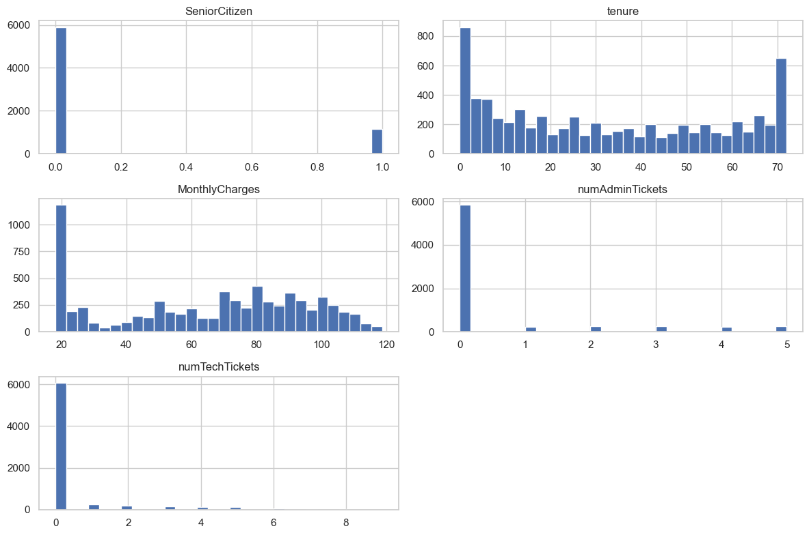
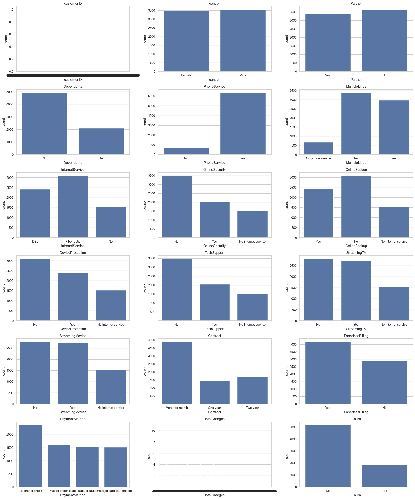
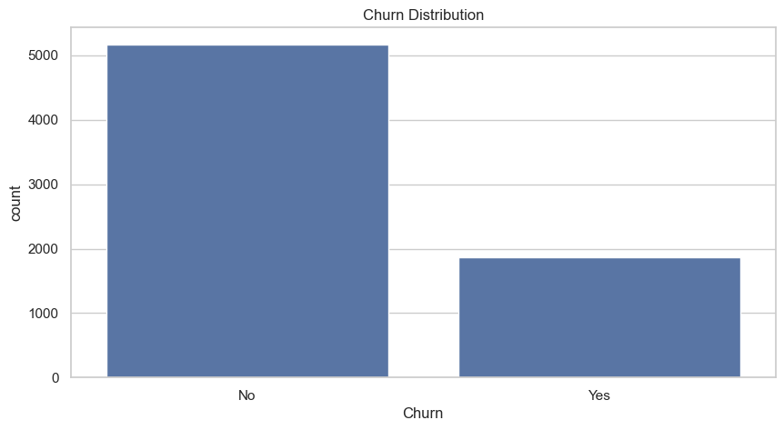
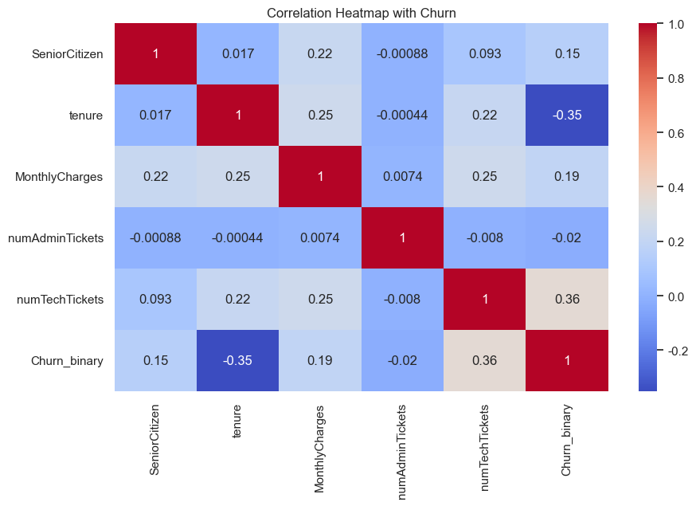
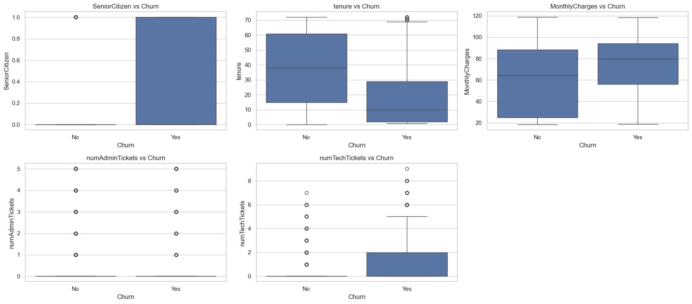
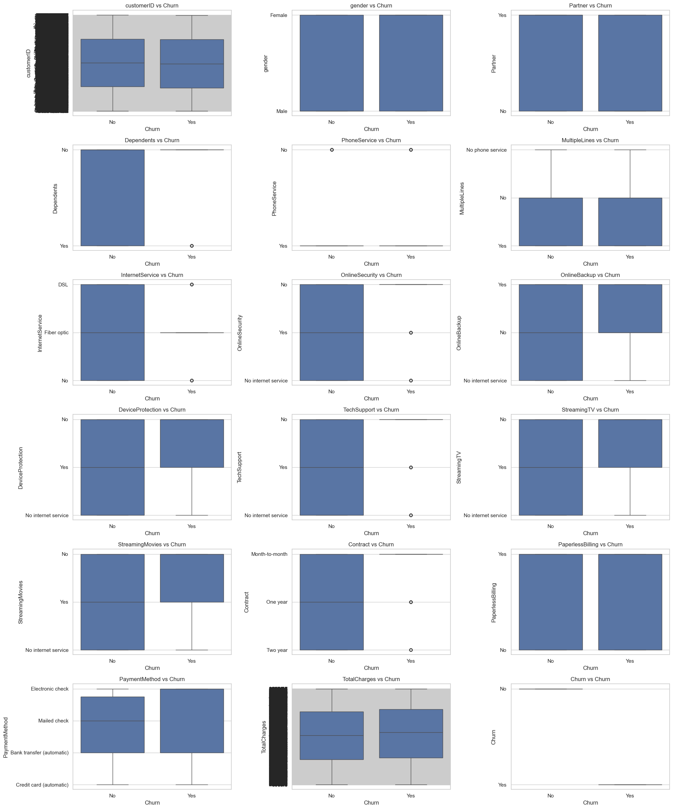

# 📊 기본 EDA & 데이터 분석 보고서  
**Dataset:** Telco Customer Churn  
**Author:** 우재현
**Version:** v1.0  
**Last Updated:** 2025-11-19  

---
<br>

# 1. 데이터 개요 (Overview)

| 항목 | 내용 |
|------|------|
| 데이터 크기 | `7043 rows × 23 columns` |
| 대상 | 통신사 고객의 이탈 여부 예측 |
| 타깃 변수 | `Churn (Yes/No)` |
| 파일명 | Customer_Churn_Dataset.csv |


<br>

# 2. 컬럼 요약 (Feature Summary)

> 각 변수의 의미 및 기본 정보 요약

| Feature | Type | 설명 | 형태 | 비고 |
|---------|------|-------|------|------|
| customerID | object | 고객 고유 식별자 | 고유값 | 예측에 불필요 |
| gender | object | 성별 | Male/Female | |
| SeniorCitizen | int64 | 고령자 여부 | 0/1 | |
| Partner | object | 결혼 여부 | Yes/No | |
| Dependents | object | 부양가족 유무 | Yes/No | |
| tenure | int64 | 이용 개월 수 | Numerical | |
| PhoneService | object | 전화 서비스 사용여부 | Yes/No | |
| MultipleLines | object | 전화서비스 중 여러 회선 사용여부 | Yes/No/No phone service | PhoneService에 종속 |
| InternetService | object | 인터넷서비스 유형 | DSL/Fiber optic/No | |
| OnlineSecurity | object | 인터넷서비스 중 온라인보안 사용여부 | Yes/No/No internet service | internetService에 종속 |
| OnlineBackup | object | 인터넷서비스 중 온라인백업 사용여부 | Yes/No/No internet service | internetService에 종속 |
| DeviceProtection | object | 인터넷서비스 중 기기보호 사용여부 | Yes/No/No internet service | internetService에 종속 |
| TechSupport | object | 인터넷서비스 중 기술지원 사용여부 | Yes/No/No internet service | internetService에 종속 |
| StreamingTV | object | 인터넷 서비스 중 스트리밍TV 사용여부 | Yes/No/No internet service | internetService에 종속 |
| StreamingMovies | object | 인터넷 서비스 중 스트리밍Movies 사용여부 | Yes/No/No internet service | internetService에 종속 |
| Contract | object | 계약유형 | Month-to-month/One year/Two year | |
| PaperlessBilling | object | 고객의 무지불 청구서 사용여부 | Yes/No | |
| PaymentMethod | object | 고객의 결제방법 | Electronic check/Mailed check/ Bank transfer/Credit card | |
| MonthlyCharges | float | 현재 요금제 기준 월 비용 | Numerical | |
| TotalCharges | object | 총 청구 금액 | object → float 변환 필요 | |
| numAdminTickets | int64 | 고객이 제출한 관리 요청 수 | Numerical | |
| numTechTickets | int64 | 고객이 제출한 기술 요청 수* | Numerical | |
| Churn | object | 이탈 여부 | Yes/No | |
---

<br>

# 3. 기본 데이터 통계 (Descriptive Stats)

### ✔ Info()
- 데이터 타입(dtype), non-null 여부 확인
- dtypes: float64(1), int64(4), object(18)
- All columns 7043 non-null
### ✔ Describe()
> 수치형 변수의 기초 통계량(mean, std, min, max 등)

| Statistic        | SeniorCitizen (binary) | tenure      | MonthlyCharges | numAdminTickets | numTechTickets |
| ---------------- | ---------------------- | ----------- | -------------- | --------------- | -------------- |
| **count**        | 7043.000000            | 7043.000000 | 7043.000000    | 7043.000000     | 7043.000000    |
| **mean**         | 0.162147               | 32.371149   | 64.761692      | 0.515689        | 0.419566       |
| **std**          | 0.368612               | 24.559481   | 30.090047      | 1.275299        | 1.250117       |
| **min**          | 0.000000               | 0.000000    | 18.250000      | 0.000000        | 0.000000       |
| **25%**          | 0.000000               | 9.000000    | 35.500000      | 0.000000        | 0.000000       |
| **50% (median)** | 0.000000               | 29.000000   | 70.350000      | 0.000000        | 0.000000       |
| **75%**          | 0.000000               | 55.000000   | 89.850000      | 0.000000        | 0.000000       |
| **max**          | 1.000000               | 72.000000   | 118.750000     | 5.000000        | 9.000000       |

- SeniorCitizen: 평균 0.16 → 약 16%가 고령자
- tenure: 중앙값 29개월 → 고객 절반은 약 2.5년 이상 유지
- numAdminTickets / numTechTickets: 대부분 0 (75% 구간이 0)
→ 고객문의 대부분이 없으며 일부 고객에게만 집중됨

<br>

# 4. 결측치 분석 (Missingness)

```python
df.isnull().sum() 
df.isna().sum()

- 전체 결측치 개수: 0
- 컬럼별 결측치 비율: 0  
- 표면적으로 보이는 결측치 미발견
```

<br>

# 5. 시각화

기본 분포 확인(수치형)



기본 분포 확인(범주형)
- TotalCharges 타입 변경 필요해보임. object -> float.
- 결측치가 빈칸으로 존재해서 기존 float type이 object로 변환된 것으로 추정



<br>

# 6. Target 분포

- 비율이 73:27정도로 불균형 데이터.
- 훈련 과정에서의 성능 개선을 위해 전처리가 필요



<br>

# 7. 상관관계 히트맵(수치형과 target binary형태)

- tenure 와 Churn → 음의 강한 관계
- MonthlyCharges 와 Churn → 양의 약한 관계
- numTechTickets와 Churn → 약하지만 의미 있는 수준



<br>

# 8. 수치형 변수 분석
- 장기 고객(tenure↑)은 이탈 가능성 낮음. 중요 Feature 가능성 높음
- 월 청구 금액(MonthlyCharges)이 높은 구간에서 이탈 비율 증가



<br>

# 9. 범주형 변수 분석
- Dependents: No가 압도적으로 많음. 중요 Feature 가능성 높음
- InternetService: Fiber-optic 가입자의 이탈률이 상대적으로 높음. 중요한 Feature 가능
- OnlineSecurity: 보안 서비스가 없는(No) 고객이 이탈률 높음. 중요한 지표. 조합 Feature 후보(ex:InternetService + OnlineSecurity)
- OnlineBackup: No가 많음. OnlineSecurity와 유사하게 No → 이탈률 상승. 조합 Feature 후보.
- DeviceProtection: No인 그룹에서 이탈률 증가. 조합 Feature 후보.
- TechSupport: TechSupport = Yes → 이탈률 크게 감소. 중요 Feature 가능성 높음.
- Contract: Month-to-month 가장 많고 이탈율도 높음. 중요 Feature 가능성 높음.
- PaperlessBilling: Yes일 때 이탈율 약간 상승.
- PaymentMethod: Electronic check 사용 시 이탈률 가장 높음



<br>

# 10. 결측치 처리 방법 및 이유
- TotalCharges를 object 타입에서 float 타입으로 형변환 하려고 했으나, 에러 발생.
- 빈칸이 있어서 에러인 것을 확인, 빈칸을 NaN으로 표기 후 타입 변경
- tenure * MonthlyCharges와 TotalCharges간의 상관관계를 발견.

- 결측치를 tenure * MonthlyCharges로 처리

<br>

# 11. 이상치 판정 기준과 처리 방법 및 이유

<br>

# 12. 적용한 Feature Engineering 방식
