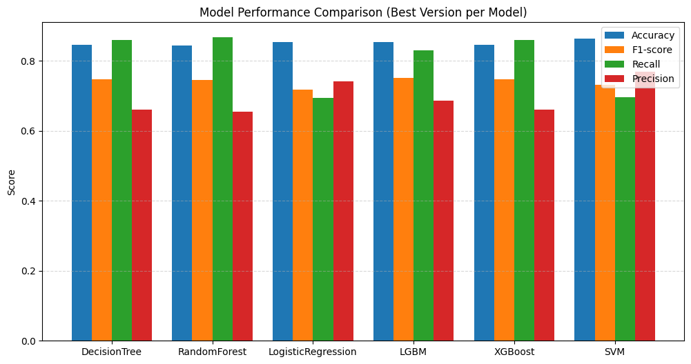
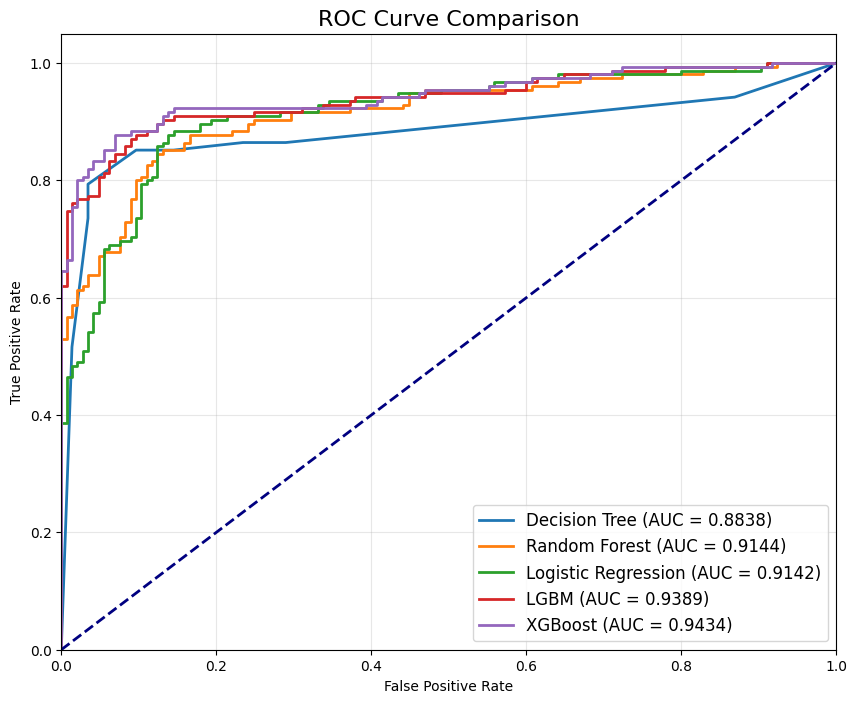
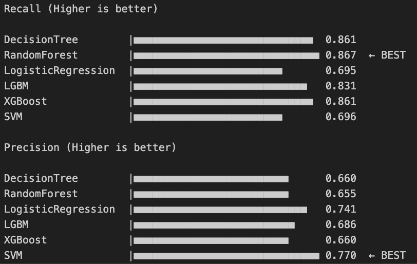
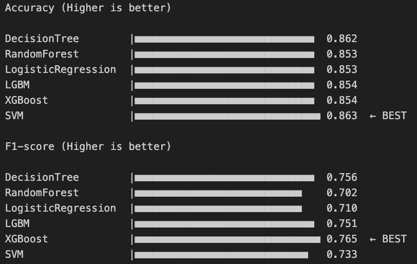

# 🤖 모델 학습 결과서
**Dataset:** Telco Customer Churn  
**Author:** 우재현  
**Last Updated:** 2025-11-25     

---
 

# 1. 최종 모델 선정을 위한 평가 지표와 그에 대한 설명

**평가 지표 선정 이유**
- Recall: 실제 이탈자를 정확하게 예측이 필요하기에 중요한 평가지표.
- Precision: 이탈 모델에서 이탈자를 잘못 파악 시 비용낭비가 발생할 수 있다.
- F1-score: Recall과 Precision 모두 중요 지표이기에 조화 평균인 F1-score를 1차 지표로 선정. 우선적으로 판단.
- Accuracy: 보조지표로 활용 예정

**종합 의사 결정 기준**
> F1-score, Recall, Precision, Accuracy 순으로 선정.
- 서비스 이용자가 통신사의 관리자이기에, 누가 실제로 이탈할 지를 놓치지 않는 것이 중요하다 생각하여, Recall을 Precision보다 더 중요한 지표로 판단한다.

- F1-score가 비슷하다면 Recall 0.75 이상을 우선 기준으로 삼고,
Recall 0.80 이상을 달성한 모델은 우수 모델로 판단한다.

 

# 2. 최종 선정 된 모델에 대한 설명

 

# 3. 학습 과정 기록
사용 모델 : DecisionTree, RandomForest, LogisticRegression, LGBM, XGBoost, SVM

모델 별 Accuracy, F1-score, Recall, Precision plot

모델 별 ROC curve와 AUC score
 

평가지표 별 최고 모델

- 하이퍼파라미터 튜닝 과정에 대한 설명
1. 인코딩 된 Impute 파일 선택
2. 모델 별 train/validation/test 셋으로 훈련
3. feature importance 와 permutation_importance 확인
4. feature selction 진행하며 성능 비교
5. 하이퍼파라미터 튜닝(GridSearchCV and Optuna)
6. threshold 조정
7. 모델 간 성능 비교하여 같은 모델 군 내 최고 성능 선정
8. 모델 별 성능 비교로 최고 모델 선택

- 최종 모델과 최종 평가 지표에 대해 기술

 

# 최종 모델과 Service application
- **최종 모델**  - models/XGB_model.pkl

- **Service application** - streamlit_py/

