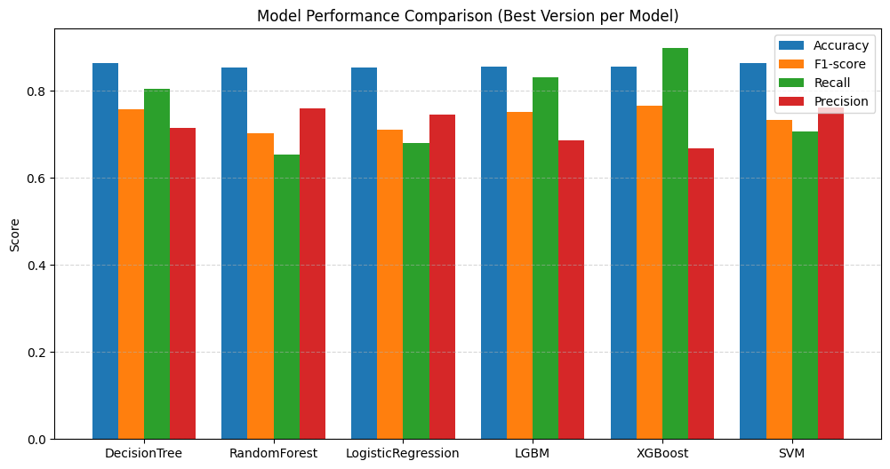

# 🤖 모델 학습 결과서
**Dataset:** Telco Customer Churn  
**Author:** 우재현, 김승룡  
**Last Updated:** 2025-11-25     

---
 

# 1. 최종 모델 선정을 위한 평가 지표와 그에 대한 설명

**평가 지표 선정 이유**
- Recall: 실제 이탈자를 정확하게 예측이 필요하기에 중요한 평가지표.
- Precision: 이탈 모델에서 이탈자를 잘못 파악 시 비용낭비가 발생할 수 있다.
- F1-score: Recall과 Precision 모두 중요 지표이기에 조화 평균인 F1-score를 1차 지표로 선정. 우선적으로 판단.
- Accuracy: 보조지표로 활용 예정

**종합 의사 결정 기준**
> F1-score, Recall, Precision, Accuracy 순으로 선정.
- 서비스 이용자가 통신사의 관리자이기에, 누가 실제로 이탈할 지를 놓치지 않는 것이 중요하다 생각하여, Recall을 Precision보다 더 중요한 지표로 판단한다.

- Telco 데이터에서 이탈 고객 비율은 약 26%로 불균형한 Class이기 때문에, 실제 이탈자를 놓치는 False Negative가 더 큰 비즈니스 손실을 발생시킨다.
따라서 Recall을 Precision보다 우선하는 지표로 설정하였다.

 

# 2. 최종 선정 된 모델에 대한 설명
**최종 선정된 모델 : XGBoost**
 

- 모델 별로 알맞게 전처리, 훈련과정을 통해 모델 내 최고 성능 모델을 확인, 이후 모델 별 성능 지표를 비교하여 선정.

- XGBoost는 Gradient Boosting 기반으로 복잡한 비선형 패턴을 잘 학습하며, 불균형 데이터에서도 강건한 성능을 보인다.
실제 실험에서도 Recall과 F1-score 모두 다른 모델보다 우수하여
이탈 고객 예측이라는 목적에 최적화된 모델임을 확인하였다.

 

# 3. 학습 과정 기록
사용 모델 : DecisionTree, RandomForest, LogisticRegression, LGBM, XGBoost, SVM

→ 모델 별 Accuracy, F1-score, Recall, Precision plot
 

→ 평가지표 별 최고 모델

- 하이퍼파라미터 튜닝 과정에 대한 설명
1. 인코딩 된 Impute 파일 선택
2. 모델 별 train/validation/test 셋으로 훈련
3. feature importance 와 permutation_importance 확인
4. feature selection 진행하며 성능 비교
5. 모델별로 다르게 하이퍼파라미터 튜닝(GridSearchCV and Optuna)
6. 튜닝한 하이퍼파라미터를 적용하여 2~4과정 다시 진행
7. threshold 조정(Recall 수치를 높이기 위함)
8. 모델 별 성능 비교로 최고 모델 선택  

**최종 모델과 최종 평가 지표에 대해 기술**
 

**XGBoost 평가지표**
 
정확도: 0.8540601930721181 
F1 점수: 0.765296803652968 
재현율: 0.8972162740899358 
정밀도: 0.6671974522292994 
Average Precision: 0.8292267171344867 
ROC-AUC Score: 0.929282407024349

>최종 모델은 Recall 0.897로 실제 이탈자 중 약 90%를 성공적으로 탐지했다.
이는 통신사가 대응해야 하는 고객 이탈 방지 전략에 매우 유효한 수준이다.
또한 ROC-AUC 0.93으로 전체적인 분류 능력도 매우 우수함을 확인하였다.
 

# 최종 모델과 Service application
- **최종 모델**  - models/XGB_model.pkl
    
- **Service application** - streamlit/
    - 제공 기능
        - 전체 유저 유지율 현황과 이탈율
        - 이탈 위험 요인 요약
        - 유저 정보 조회
        - 가상/신규 유저 예측

